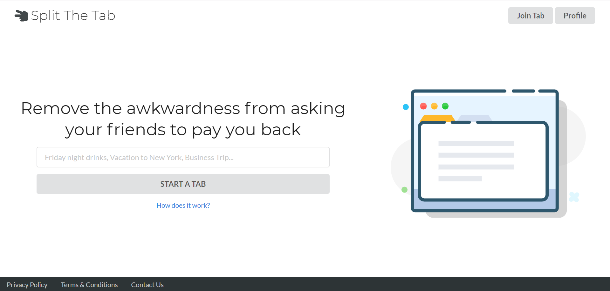
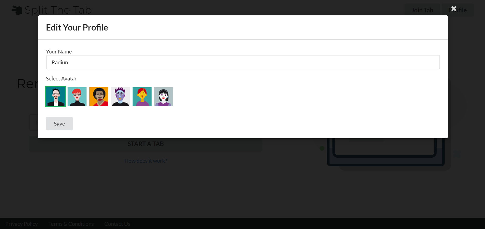
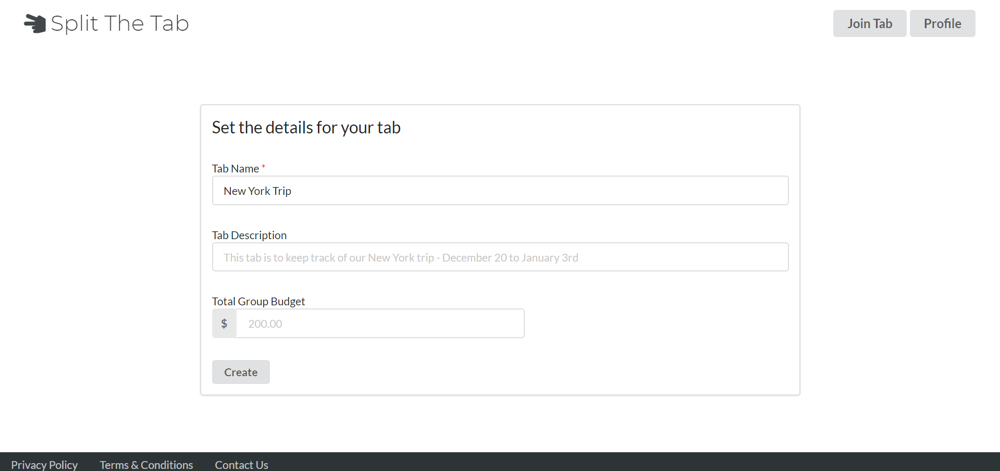
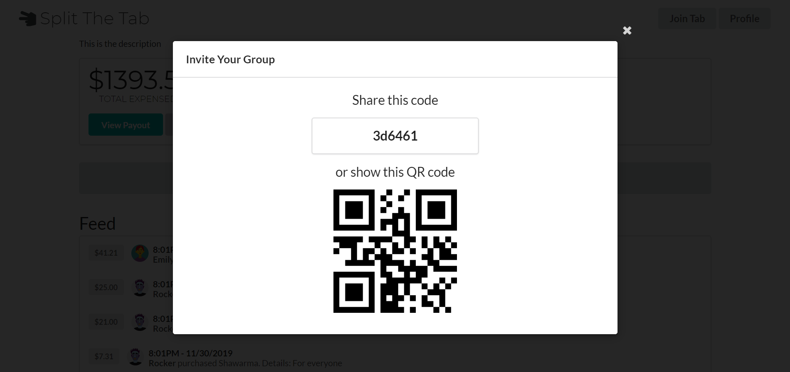
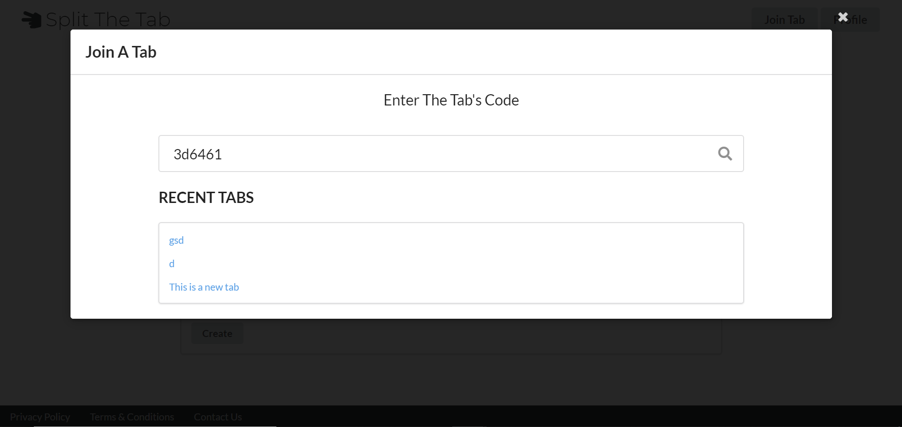
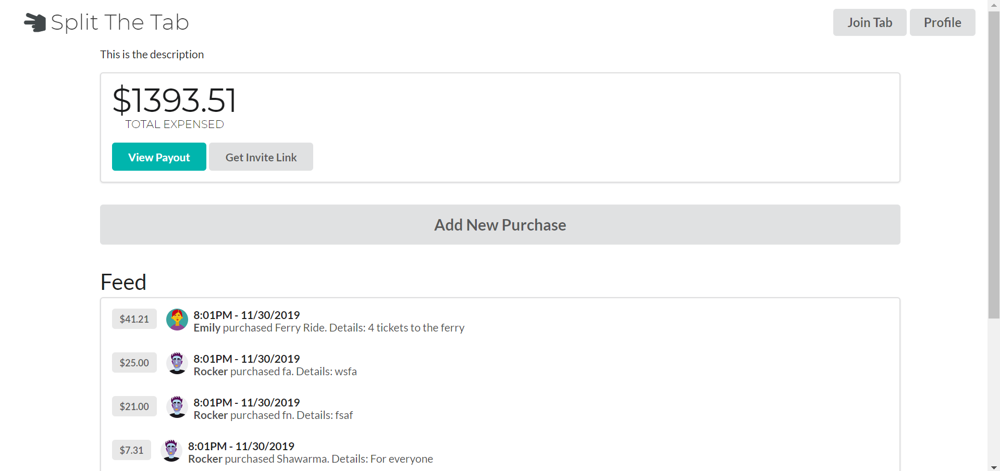
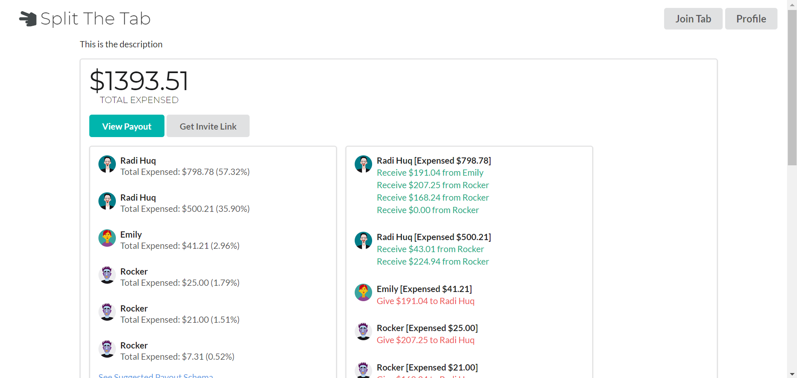

# Split The Tab
Remove the awkwardness from asking your friends to pay you back.

This platform allows you to collaboratively track your expenses with your peers. It can also calculate the best way to pay each other back using the minimum amount of transactions.

### Demo
[https://split.mrhuq.com](https://split.mrhuq.com)

### Installation
Clone this repo to your machine and run `npm install`

`https://github.com/radihuq/split-the-tab.git`

### Technologies
This project uses:
* ReactJS
* Node.js
* MongoDB
* Semantic UI
* Axios
* [qrcode.React](https://github.com/zpao/qrcode.react)
* [react-qr-reader](https://github.com/JodusNodus/react-qr-reader)
* Express
* Mongoose

### Usage
Profile data is stored in local/session storage so view this project in a non-incognito browser for the best experience.

### Screenshots

*Split The Tab Home Page*

*Edit Your Profile*

*Create A New Tab*

*Invite Your Peers*

*Join A Tab*

*Tab's Dashboard*

*Tab Expenses & Payout Schema*

### Author
This project was created by Radiun Huq. You can reach him at:

`Email: radi@mrhuq.com`

`Twitter: @radiunhuq`

#### Credits:
Logo icon made by [Tomas Knop]("https://www.flaticon.com/authors/tomas-knop") from [www.flaticon.com](https://www.flaticon.com/)